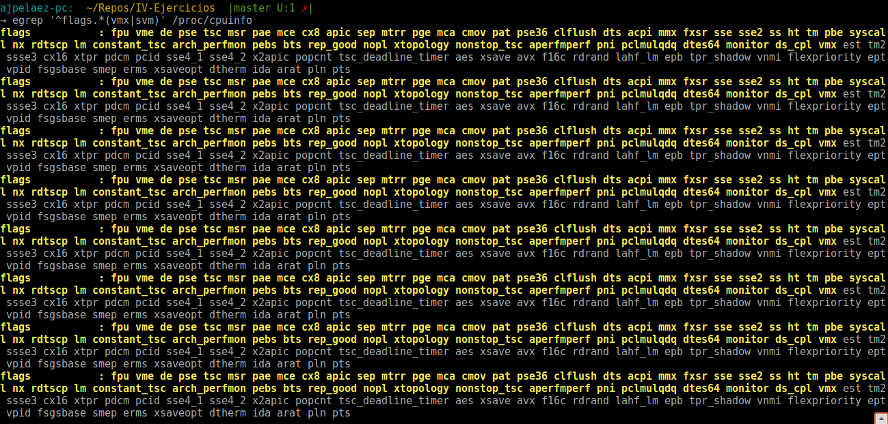

# Introducción a la infraestructura virtual: concepto y soporte físico
---
## Ejercicio 1: *Consultar en el catálogo de alguna tienda de informática el precio de un ordenador tipo servidor y calcular su coste de amortización a cuatro y siete años.*

### Selección de servidor

En mi caso he consultado el catálogo de la tienda [HP](http://store.hp.com/us/en/mdp/dl380-gen-9-servers#!&tab=vao). Los precios varían desde 1900$ hasta 7500$ por el servidor, aunque luego el precio se puede incrementar si necesitamos alguna serie de extras.

Seleccionaremos [este servidor](http://store.hp.com/us/en/pdp/hp-proliant-dl380-g9-2u-rack-server---intel-xeon-e5-2620-v4-octa-core-%288-core%29-210-ghz---64-gb-installed-ddr4-sdram---serial-a) por precio de 3500$ sin añadir ningun extra.

 El equivalente de 3500$ sería unos **2920€**, aunque a esto hay que añadirle los impuestos que no iban incluidos en la web de HP por lo tanto el precio total sería **3530€** añadiendole el 21% de IVA.

### Cálculo del coste de amortización:

El primer dato importante es que el IVA nos lo podemos deducir, por lo que no lo incluiremos en el coste de amortización, asi que diremos que el servidor nos costó **2920€**.

Consultando la [tabla de amortización de 2017](http://www.agenciatributaria.es/AEAT.internet/Inicio/_Segmentos_/Empresas_y_profesionales/Empresarios_individuales_y_profesionales/Rendimientos_de_actividades_economicas_en_el_IRPF/Regimenes_para_determinar_el_rendimiento_de_las_actividades_economicas/Estimacion_Directa_Simplificada.shtml) en la web de la agencia tributaria vemos que **como máximo podemos amortizar un 26% del coste del equipo anualmente, y el máximo periódo de amortización sería 10 años.**

| Años | Amortización anual | % Amortizado anulamente | Amortización total |
| ---- | ------------------ | ----------------------- | ------------------ |
| 4 |  730 € | 25 % | 2920€ |
| 7 | 417.14 € | 14.3 % | 2920€ |

---

---

## Ejercicio 2:  *Usando las tablas de precios de servicios de alojamiento en Internet “clásicos”, es decir, que ofrezcan Virtual Private Servers o servidores físicos, y de proveedores de servicios en la nube, comparar el coste durante un año de un ordenador con un procesador estándar (escogerlo de forma que sea el mismo tipo de procesador en los dos vendedores) y con el resto de las características similares (tamaño de disco duro equivalente a transferencia de disco duro) en el caso de que la infraestructura comprada se usa sólo el 1% o el 10% del tiempo.*

Como provedoor de servicios "clásicos" eligiremos **Ginernet** y como proveedorde servicios en la nube **DigitalOcean**.

| Proveedor | Producto | Disco duro | RAM | Procesador | Precio |
| ------------------ | ---------------- | ------------------ | -------- | -------------------- | ---------- |
| [Ginernet](https://ginernet.com/es/servidores/vps/openvz/ssd/) | SSD-1G-LEB |  20 GB SSD | 1 GB | 1 vCPU |  6,04€/mes |
| [DigitalOcean](https://www.digitalocean.com/pricing/) | 10$ Droplet | 30GB SSD | 1 GB | 1vCPU | 8,36€/mes (0,012€/hora) |

### Coste anual
| Proveedor | Tiempo de uso | Precio | Coste anual |
| ------------------ | ------------------------ | ----------- | -------------------- |
| Ginernet | 1 % (3.65 días, 88 horas) | 6,04€/mes | **72,48€** |
| DigitalOcean | 1 % (3.65 días, 88 horas) | 0,012€/hora |  **1,056€** |
| Ginernet | 10 % (36.5 días, 876 horas) | 6,04€/mes | **72,48€** |
| DigitalOcean | 10 % (36.5 días, 876 horas) | 0,012€/hora |  **10,51€** |

Como podemos ver la diferencia va desde pagar **7 veces más** en el caso de un 10% de uso de la infraestructura a pagar **72 veces más** en el caso de uso de 1%. Esto se debe a que un servicio "clásico" deberíamos pagarlo mes a mes, estemos usándolo o no, mientras que en un servicio en la nube solo pagaríamos por el tiempo que usamos la infraestructura.

---

---

## Ejercicio 3:  *En general, cualquier ordenador con menos de 5 o 6 años tendrá estos flags. ¿Qué modelo de procesador es? ¿Qué aparece como salida de esa orden? Si usas una máquina virtual, ¿qué resultado da? ¿Y en una Raspberry Pi o, si tienes acceso, el procesador del móvil?*

El modelo del procesador de mi ordenador portátil es:
 **Intel(R) Core(TM) i7-3632QM CPU @ 2.20GHz**. 

Al ejecutar el comando: 

~~~
egrep '^flags.*(vmx|svm)' /proc/cpuinfo
~~~

La salida es la siguiente:

El modelo del procesador de mi móvil es: 
**ARMv7 Processor rev 4 (v7l)**.

La salida del comando egrep es la siguiente:

Con lo que concluimos que el procesador de mi portátil tiene posibilidad de virtualizar pero el de mi móvil no.

---

---

## Ejercicio 4:  *Comprobar si el núcleo instalado en tu ordenador contiene este módulo del kernel usando la orden kvm-ok. Instalar un hipervisor para gestionar máquinas virtuales, que más adelante se podrá usar en pruebas y ejercicios.*

Ejecutamos el comando **kvm-ok** y vemos que la salida es:

Por lo vemos que nuestro núcleo contiene el módulo del kernel.

Como hipervisor usaremos virtualbox que ya lo teníamos instalado anteriormente.

---

---

## Ejercicio 5:  *Darse de alta en servicios de nube usando ofertas gratuitas o cupones que pueda proporcionar el profesor.*

awgwagaga

---

---

## Ejercicio 6:  *Darse de alta en una web que permita hacer pruebas con alguno de los sistemas de gestión de nube anteriores.*

fwafafa

