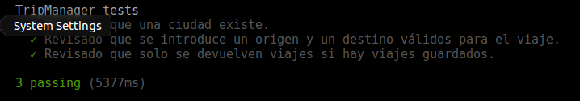

# Desarrollo basado en pruebas
---
## Ejercicio 1: *Hacer un pull request a este proyecto con tests adicionales, si es que faltan (en el momento que se lea este tema).*

No faltan test adicionales por añadir.

---

---

## Ejercicio 2:  *Para la aplicación que se está haciendo, escribir una serie de aserciones y probar que efectivamente no fallan. Añadir tests para una nueva funcionalidad, probar que falla y escribir el código para que no lo haga (vamos, lo que viene siendo TDD).*

Ejercicio realizado junto con el proyecto de la asignatura, aquí dejo algunas de las aserciones creadas para el test de una función:

~~~
def testCheckCity(self):
    self.tripManager = TripManager.TripManager()
    self.assertTrue(self.tripManager.checkCity("Granada"))
    self.assertFalse(self.tripManager.checkCity("Grandadada"))
~~~

---

---

## Ejercicio 3:  *Convertir los tests unitarios anteriores con assert a programas de test y ejecutarlos desde mocha, usando descripciones del test y del grupo de test de forma correcta. Si hasta ahora no has subido el código que has venido realizando a GitHub, es el momento de hacerlo, porque lo vas a necesitar un poco más adelante.*

~~~
@describe('TripManager tests')
def _():

    #Testea la funcion checkCity de la clase TripManager
    @it('Revisado que una ciudad existe.')
    def testCheckCity():
        tripManager = TripManager.TripManager()
        assert(True, tripManager.checkCity("Granada"))
        assert(False, tripManager.checkCity("Grandadada"))

    #Testea la funcion setTrips de la clase TripManager
    @it('Revisado que se introduce un origen y un destino válidos para el viaje.')
    def testSetTrips():
        tripManager = TripManager.TripManager()
        assert (1, tripManager.setTrips("",""))
        assert (2, tripManager.setTrips("Grandadada",""))
        assert (3, tripManager.setTrips("Granada","Grandadada"))
        assert (0, tripManager.setTrips("Granada","Madrid"))

    #Testea la funcion getTrips de la clase TripManager
    @it('Revisado que solo se devuelven viajes si hay viajes guardados.')
    def testGetTrips():
        tripManager = TripManager.TripManager()
        tripManager.trips = None
        assert (1, tripManager.getTrips())

        tripManager.setTrips("Granada","Madrid")
        api = BlaBlaCarApi(api_key="713d0cd3340f4e428c54177955de9f25", locale="es_ES", currency="es_ES")
        tipo = type(api.trips(frm="Granada", to="Madrid")).__name__
        tipo2 = type(tripManager.getTrips()).__name__
        assert (tipo, tipo2)
~~~

---

---

## Ejercicio 4: *Instalar alguno de los entornos virtuales de node.js (o de cualquier otro lenguaje con el que se esté familiarizado) y, con ellos, instalar la última versión existente, la versión minor más actual de la 4.x y lo mismo para la 0.11 o alguna impar (de desarrollo).*

~~~
sudo apt-get install virtualenv python-virtualenv
virtualenv --python=/usr/bin/python2.7 python2.7
virtualenv --python=/usr/bin/python3.5 python3.5
~~~

## Ejercicio 5: *Como ejercicio, algo ligeramente diferente: una web para calificar las empresas en las que hacen prácticas los alumnos.*

Las acciones serían

Crear empresa
Listar calificaciones para cada empresa
crear calificación y añadirla (comprobando que la persona no la haya añadido ya)
borrar calificación (si se arrepiente o te denuncia la empresa o algo)
Hacer un ránking de empresas por calificación, por ejemplo
Crear un repositorio en GitHub para la librería y crear un pequeño programa que use algunas de sus funcionalidades.
Si se quiere hacer con cualquier otra aplicación, también es válido.

Se trata de hacer una aplicación simple que se pueda hacer rápidamente con un generador de aplicaciones como los que incluyen diferentes marcos MVC. Si cuesta mucho trabajo, simplemente prepara una aplicación que puedas usar más adelante en el resto de los ejercicios.*

He creado una pequeña aplicación en python que implementa todas las funciones descritas en el ejercicio.
[Enlace al repositorio de la aplicación](https://github.com/ajpelaez/RateCompany)

---

---

## Ejercicio 6: *Ejecutar el programa en diferentes versiones del lenguaje. ¿Funciona en todas ellas?*

Hemos ejecutado el programa con Python 2.7 y con Python 3 y en este caso funciona en ambas.

---

---

## Ejercicio 7: *Crear una descripción del módulo usando package.json. En caso de que se trate de otro lenguaje, usar el método correspondiente.*

Para esto hemos usado la herramienta pip, creando un fichero requirements.txt que contiene las dependencias necesarias para ejecutar nuestro proyecto:
~~~
pyTelegramBotAPI==3.2.1
git+git://github.com/ajpelaez/BlaBlaCar-Client-Api@master
git+git://github.com/ajpelaez/pocha
~~~

---

---

## Ejercicio 9: *Haced los dos primeros pasos antes de pasar al tercero:*

1. Darse de alta. Muchos están conectados con GitHub por lo que puedes autentificarte directamente desde ahí. A través de un proceso de autorización, puedes acceder al contenido e incluso informar del resultado de los tests a GitHub.
2. Activar el repositorio en el que se vaya a aplicar la integración continua. Travis permite hacerlo directamente desde tu configuración; en otros se dan de alta desde la web de GitHub.
3. Crear un fichero de configuración para que se ejecute la integración y añadirlo al repositorio.

Para la resolución de este ejercicion nos hemos registrado en Travis usando nuestra cuenta de GitHub para vincularla directamente, después se ha añadido Travis al repositorio del proyecto y por último lo hemos configurado con el archivo de configuración travis.yml
