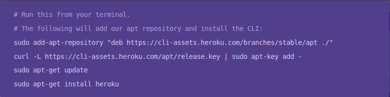
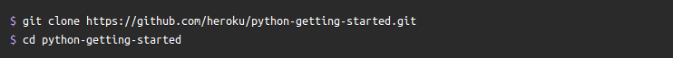
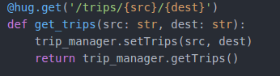
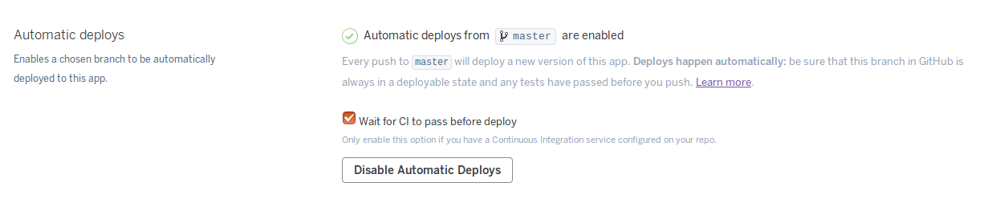

# Desplegando aplicaciones en la nube: Uso de PaaS
---
## Ejercicio 1: *Darse de alta en algún servicio PaaS tal como Heroku, Nodejitsu, BlueMix u OpenShift.*

Hemos escogido Heroku como servicio PaaS, me he registrado en su sitio web y he empezado a familiarizarme con la plataforma.

---

---

## Ejercicio 2: *Crear una aplicación en OpenShift o en algún otro PaaS en el que se haya dado uno de alta. Realizar un despliegue de prueba usando alguno de los ejemplos.*

Crearemos la aplicación en Heroku, primero tenemos que instalar Heroku en nuestro ordenador:

Descargamos la aplicación de prueba que nos ofrece Heroku en local:

Luego pasamos al despliegue:
~~~
heroku create
git push heroku master
heroku run python manage.py migrate
heroku open
~~~
Y finalmente comprobamos que tenemos nuestra apliación funcionando en [Heroku](https://shrouded-tundra-78673.herokuapp.com/).

---

---

## Ejercicio 3: *Realizar una app en express (o el lenguaje y marco elegido) que incluya variables como en el caso anterior.*

Este ejercicio lo he resuelto usando Hug (un framework para crear APIs REST en python) en el hito 3 de la asignatura donde mi app lee varias variables en algunos métodos como este:

---

---

## Ejercicio 4: *Crear pruebas para las diferentes rutas de la aplicación.*

Para resolver este ejercicio se han creado varios test funcionales para testear las diferentes rutas de nuestra aplicación.
[Link al fichero con los tests](https://github.com/ajpelaez/IV-Proyecto/blob/master/FindBlaBlaCarBot/test.py)

---

---

## Ejercicio 5: *Instalar y echar a andar tu primera aplicación en Heroku.*

Además de hacerlo para el hito 3, lo hice también en el ejercicio 2.
[App de ejemplo](https://shrouded-tundra-78673.herokuapp.com/)
[App para el hito](http://blablacarapi.herokuapp.com/)

---

---

## Ejercicio 7: *Haz alguna modificación a tu aplicación en node.js para Heroku, sin olvidar añadir los tests para la nueva funcionalidad, y configura el despliegue automático a Heroku usando Snap CI o alguno de los otros servicios, como Codeship, mencionados en StackOverflow.*

En mi caso uso Travis como sistema de integración continua y tras hacer un push a mi repositorio hasta que no se pasan los test no se hace el deploy a Heroku, y en caso de que no se pasen no se hace deploy, para esto tuve que activar algunas opciones en Heroku.

## Ejercicio 8: *Preparar la aplicación con la que se ha venido trabajando hasta este momento para ejecutarse en un PaaS, el que se haya elegido.*

Para preparar la aplicación he creado y configurado los archivos requeriments.txt y Procfile en el repositorio.
