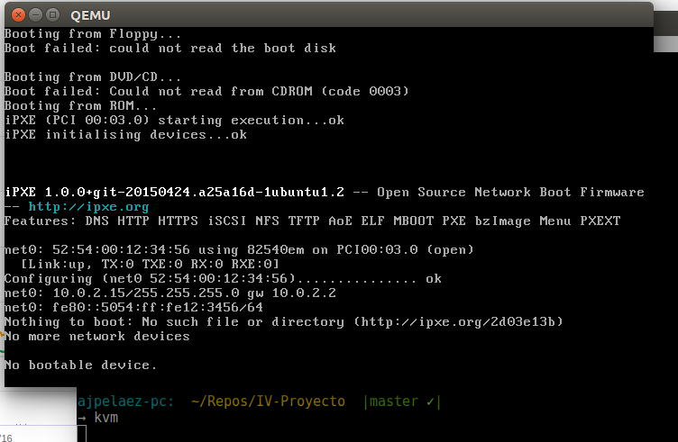
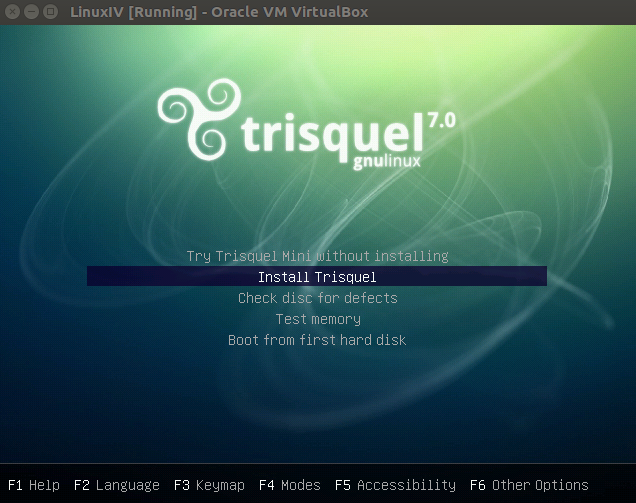

# Virtualización completa: uso de máquinas virtuales

---
## Ejercicio 1: *Instalar los paquetes necesarios para usar KVM. Se pueden seguir estas instrucciones. Ya lo hicimos en el primer tema, pero volver a comprobar si nuestro sistema está preparado para ejecutarlo o hay que conformarse con la paravirtualización.*

~~~
apt-get install qemu-kvm libvirt-bin  
apt-get install bridge-utils virt-manager
~~~

---

---

## Ejercicio 2: *Crear varias máquinas virtuales con algún sistema operativo libre tal como Linux o BSD. Si se quieren distribuciones que ocupen poco espacio con el objetivo principalmente de hacer pruebas se puede usar CoreOS (que sirve como soporte para Docker) GALPon Minino, hecha en Galicia para el mundo, Damn Small Linux, SliTaz (que cabe en 35 megas) y ttylinux (basado en línea de órdenes solo).*

## *Hacer un ejercicio equivalente usando otro hipervisor como Xen, VirtualBox o Parallels.*

---

---

## Ejercicio 3: *Crear un benchmark de velocidad de entrada salida y comprobar la diferencia entre usar paravirtualización y arrancar la máquina virtual simplemente con qemu-system-x86_64 -hda /media/Backup/Isos/discovirtual.img*

---

---

## Ejercicio 4: *Crear una máquina virtual Linux con 512 megas de RAM y entorno gráfico LXDE a la que se pueda acceder mediante VNC y ssh.*

He decidido instalar Trisquel mini, que es una distribución bastante ligera y con LXDE.

~~~
sudo apt-get install vnc4server
vncserver
~~~

Y conecto con algun cliente de vnc, en mi caso use RealVNC

## Ejercicio 5: *Crear una máquina virtual ubuntu e instalar en ella alguno de los servicios que estamos usando en el proyecto de la asignatura.*

---

---

## Ejercicio 6: *Instalar una máquina virtual con Linux Mint para el hipervisor que tengas instalado*

---

---
